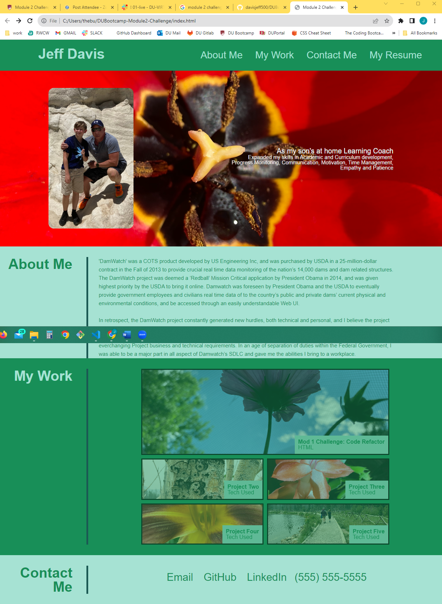

# DUBootcamp-Mod2-Challenge Solution- Personal Portfolio by Jeff Davis

<h2>Deployed Solution Location</h2>

https://davisjeff500.github.io/DUBootcamp-Module2-Challenge/

<h2>Solution Method</h2>

This repo contains an online personal portfolio solution employing CSS Pseudo classes and elements.  It also employs flex property and @media queries for display properties and alternate device viewports.

<h3>Solution Screenshot</h3>

<h3>Code Source</h3> 

https://github.com/davisjeff500/DUBootcamp-Module2-Challenge

<h3>Credits and documentation used for this project.</h3> 

See 

CSS Cheatsheet https://htmlcheatsheet.com/css/ 
MDN Web Docs - CSS https://developer.mozilla.org/en-US/docs/Web/CSS 
W3 Schools CSS - https://www.w3schools.com/css/default.asp 
reset.css by Maria 
Framework Ideas jlawton https://github.com/jdlawton 